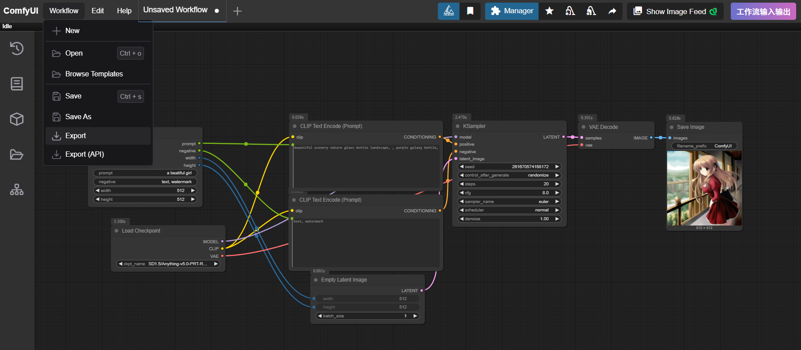

# ComfyUI-iyunya-nodes

ComfyUI-iyunya-nodes 是一个 [ComfyUI](https://github.com/comfyanonymous/ComfyUI) 自定义节点集合，提供动态创建输入/输出节点的功能，方便构建更加模块化和灵活的工作流。

## 🆕 新功能：阿里云百炼文字识别 (Qwen-VL OCR)

新增基于阿里云百炼大模型服务的图片文字识别节点，支持：
- 🔍 高精度OCR文字识别  
- 📍 自动标注文字区域坐标
- 🌐 多语言识别和翻译
- 🎨 可视化边界框标记
- 🎭 生成文字区域遮罩
- 📊 结构化JSON输出

**使用方法**: 详见 [Qwen-VL OCR 插件说明](README_QwenVL_OCR.md)

## 🆕 新功能：文字叠加显示 (Text Overlay)

新增文字叠加显示节点，完美配合OCR识别结果，支持：
- 📝 将OCR识别的文字直接显示在图片上
- 🎨 自定义字体大小、颜色、背景色
- 📍 多种文字位置模式（上方、下方、中心、左右）
- 🌏 自动检测和使用系统中文字体
- 🎛️ 透明度控制和自定义字体支持

**使用方法**: 详见 [文字叠加插件说明](README_TextOverlay.md)

## 使用示例

1. 创建输入参数节点

点击右上角【工作流输入输出】编辑输入参数节点定义

   

2. 选择输入参数节点

创建节点定义后刷新页面，即可通过【工作流】/【输入】选择之前创建的节点

   

3. 配置工作流

将该节点用于工作流配置

   

4. 导出工作流

导出工作流json，通常会导出后在服务侧存储

   

5. API对接逻辑

导出的工作流json，根据nodes中type前缀 `iyunya_in_` 即可定位到输入节点，根据其中outputs参数解析，即可进行API参数替换

```json

    {
      "id": 10,
      "type": "iyunya_in_93edec8c",
      "pos": [
        -138.034423828125,
        203.829833984375
      ],
      "size": [
        315,
        190
      ],
      "flags": {},
      "order": 1,
      "mode": 0,
      "inputs": [],
      "outputs": [
        {
          "label": "prompt",
          "name": "prompt",
          "type": "STRING",
          "links": [
            10
          ]
        },
        {
          "label": "negative",
          "name": "negative",
          "type": "STRING",
          "links": [
            11
          ]
        },
        {
          "label": "width",
          "name": "width",
          "type": "INT",
          "links": [
            12
          ]
        },
        {
          "label": "height",
          "name": "height",
          "type": "INT",
          "links": [
            13
          ]
        }
      ],
      "properties": {
        "cnr_id": "comfy-core",
        "ver": "0.3.29",
        "Node name for S&R": "iyunya_in_93edec8c"
      },
      "widgets_values": [
        "a beatiful girl",
        "text, watermark",
        512,
        512
      ]
    }


```

## 功能特点

- **动态节点创建**：允许用户通过界面动态创建自定义输入和输出节点
- **工作流模块化**：通过自定义输入/输出节点，实现工作流的模块化设计
- **参数类型支持**：支持多种数据类型，包括文本(STRING)、整数(INT)、浮点数(FLOAT)和布尔值(BOOLEAN)
- **持久化存储**：自动保存创建的节点配置，重启ComfyUI后仍可使用
- **用户友好界面**：提供直观的界面创建和管理自定义节点

## 安装方法

1. 克隆或下载本仓库到ComfyUI的`custom_nodes`目录中:

```bash
cd ComfyUI/custom_nodes
git clone https://github.com/iyunya/ComfyUI-iyunya-nodes.git
```

2. 重启ComfyUI服务器

## 使用方法

### 创建自定义节点

1. 在ComfyUI界面中，点击工具栏上的"工作流输入输出"按钮
2. 选择"创建输入节点"或"创建输出节点"
3. 在弹出的对话框中，填写节点名称和定义参数
4. 点击"创建节点"按钮
5. 按照提示刷新页面，即可在节点列表中找到新创建的节点

### 管理自定义节点

1. 在ComfyUI界面中，点击工具栏上的"工作流输入输出"按钮
2. 选择"管理自定义节点"
3. 在弹出的对话框中，可以查看、删除已创建的自定义节点

### 在工作流中使用

- 创建的输入节点位于"工作流/输入"类别下
- 创建的输出节点位于"工作流/输出"类别下
- 输入节点用于接收参数，并将其传递给后续节点
- 输出节点用于接收工作流的结果，可以作为模块化工作流的输出端口

## 节点类型说明

### 输入节点(In)

输入节点作为工作流的入口，允许用户设置参数值，并将这些值传递给其他节点。这类似于函数的参数定义。

### 输出节点(Out)

输出节点作为工作流的出口，接收来自其他节点的数据。当主工作流引用子工作流时，这些输出值将被返回给主工作流。

## 注意事项

- 创建新节点后需要刷新页面才能在节点列表中看到
- 节点ID在同一组内必须唯一（输入节点和输出节点分别是独立的组）
- 参数名称建议使用英文字母和数字，避免使用特殊字符

## 许可证

本项目使用 [MIT 许可证](LICENSE) 